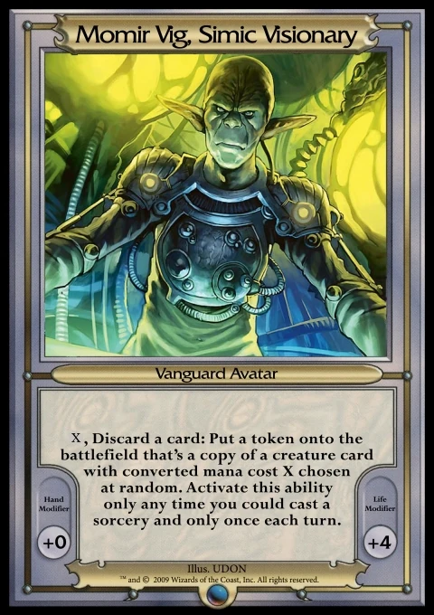

# Momir Basic Printer (MBP)

Momir Basic Printer (MBP) is a set of Python scripts designed to run headless on a Raspberry Pi connected to a thermal receipt printer for playing the [Momir Basic](https://magic.wizards.com/en/formats/momir-basic) MTG format.

## Table of Contents

- [About](#about)
- [Hardware](#hardware)
  - [Components](#components)
  - [Pinout](#pinout)
- [Installation](#installation)
- [Service Management](#service-management)
- [Momir Basic Rules](#momir-basic-rules)
- [Disclaimer](#disclaimer)

## About

Downloads card data from the [Scryfall API](https://scryfall.com/docs/api) and prints a random card on demand when a button is pressed. The card images are converted to monochrome and printed using a thermal receipt printer. The card name is also displayed on an OLED screen.

## Hardware

### Components

- [Raspberry Pi 3 Model B+](https://www.raspberrypi.com/products/raspberry-pi-3-model-b-plus/)
- ...

### Pinout

...

## Installation

1. Clone this repository and navigate to the project directory.

```shell
git clone https://github.com/MoritzHayden/momir-basic-printer.git
cd momir-basic-printer
```

2. Open [src/config.ini](src/config.ini) in a text editor and update the configuration variables to add your specific settings (like printer connection details, GPIO pins, and other hardware settings) before proceeding.

```shell
nano src/config.ini
```

3. Make the setup script executable and run it. This will automatically install dependencies and configure the systemd background service.

```shell
chmod +x setup.sh
./setup.sh
```

_(Note: If you are running a minimal setup and explicitly require the service to run as root, you can bypass the safety check by running `sudo ./setup.sh --allow-root`)_

## Service Management

View live logs and print statements:

```shell
sudo journalctl -u momir-basic-printer.service -f
```

Check the current status of the service:

```shell
sudo systemctl status momir-basic-printer.service
```

Restart the service (required after making code changes):

```shell
sudo systemctl restart momir-basic-printer.service
```

Stop the service:

```shell
sudo systemctl stop momir-basic-printer.service
```

## Momir Basic Rules

- Number of Players: 2
- Starting Life Total: 24
- Game Duration: 10 minutes
- Deck Size: 60+ basic lands

Each turn players discard a basic land to activate Momir Vig's ability and get a random creature from throughout Magic's history!



## Disclaimer

Neither this project nor its contributors are associated with Hasbro, Wizards of the Coast, or _Magic: The Gathering_ in any way whatsoever.

<div align="center">
  <p>Copyright &copy; 2026 Hayden Moritz</p>
</div>
