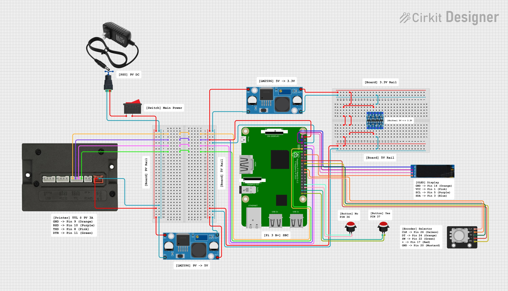

# Momir Basic Printer (MBP)

Momir Basic Printer (MBP) is a set of Python scripts designed to run headless on a Raspberry Pi connected to a thermal receipt printer for playing the [Momir Basic](https://magic.wizards.com/en/formats/momir-basic) MTG format.

> [!NOTE]
> This project is a work in progress and is not yet fully functional. Please check back for updates as I continue to work on this project!

## TODO

- [x] Update Scryfall refresh to only download new cards instead of re-downloading the entire database every time
- [ ] Document configuration in README
- [ ] Enhance CLI for better user experience and error handling
- [ ] Add thermal printer integration
- [ ] Add OLED display integration
- [ ] Add rotary encoder and button input
- [ ] Create pinout diagram

## Table of Contents

- [About](#about)
- [Examples](#examples)
- [Hardware](#hardware)
  - [Components](#components)
  - [Diagram](#diagram)
- [Installation](#installation)
- [Configuration](#configuration)
- [Service Management](#service-management)
- [Momir Basic Rules](#momir-basic-rules)
- [Disclaimer](#disclaimer)

## About

Downloads card data from the [Scryfall API](https://scryfall.com/docs/api), including card art which is dithered to monochrome on-device, and prints a random card within a set CMC value on demand via thermal printer. All settings are configurable via [config.ini](src/config.ini), and the software can run as a background service on any Linux-based SBC with GPIO. The complete hardware setup is designed to be compact and portable, with all components housed in a waterproof case.

## Examples

| Physical Card                                           | Printed Card                                              |
| ------------------------------------------------------- | --------------------------------------------------------- |
|  |  |

## Hardware

### Components

- [Raspberry Pi 3 Model B+](https://www.raspberrypi.com/products/raspberry-pi-3-model-b-plus/)
- [Adafruit T-Cobbler Plus GPIO Breakout](https://a.co/d/0fnKGt3A)
- [Maikrt MC206H Thermal Printer](https://a.co/d/06qIKsng)
- [PAPRMA 57mm x 30mm Thermal Paper](https://a.co/d/04u2Gb2j)
- [MakerFocus 20200330-SD8V OLED Display](https://a.co/d/06Y7V5Uj)
- [KY-040 Rotary Encoder Module](https://a.co/d/0hN4SBto)
- [Nilight 12V 20A SPST Rocker Toggle Switch](https://a.co/d/02VcvtcQ)
- [EG STARTS 24mm Arcade Push Buttons](https://a.co/d/0jlW1BSk)
- [SHNITPWR 60W Universal Power Supply](https://a.co/d/0bKNzwey)
- [LM2596 Buck Converter](https://a.co/d/070NjEDp)
- [KeeYees 4 Channel IIC I2C Logic Level Converter](https://a.co/d/0ecOK7n6)

### Diagram



## Installation

1. Clone this repository and navigate to the project directory.

```shell
git clone https://github.com/MoritzHayden/momir-basic-printer.git
cd momir-basic-printer
```

2. Open [src/config.ini](src/config.ini) in a text editor and update the configuration variables to add your specific settings (like printer connection details, GPIO pins, and other hardware settings) before proceeding.

```shell
nano src/config.ini
```

3. Make the setup script executable and run it. This will automatically install dependencies and configure the systemd background service.

```shell
chmod +x setup.sh
./setup.sh
```

> [!TIP]
> If you are running a minimal setup and explicitly require the service to run as root, you can bypass the safety check by running: `sudo ./setup.sh --allow-root`

## Configuration

All configuration variables are stored in [src/config.ini](src/config.ini). Update the values in this file to match your specific hardware setup and preferences. After making changes to the configuration, restart the service for the changes to take effect.

| **Section**  | **Variable**             | **Type** | **Description** |
| ------------ | ------------------------ | -------- | --------------- |
| `FILESYSTEM` | `cards_path`             | ...      | ...             |
| `FILESYSTEM` | `art_path`               | ...      | ...             |
| `FILESYSTEM` | `default_card_art_path`  | ...      | ...             |
| `FILESYSTEM` | `access_rights`          | ...      | ...             |
| `LOGGING`    | `log_level`              | ...      | ...             |
| `LOGGING`    | `log_format`             | ...      | ...             |
| `PRINTER`    | `paper_width_mm`         | ...      | ...             |
| `PRINTER`    | `paper_width_chars`      | ...      | ...             |
| `PRINTER`    | `card_art_enabled`       | ...      | ...             |
| `PRINTER`    | `qr_code_enabled`        | ...      | ...             |
| `PRINTER`    | `qr_code_size`           | ...      | ...             |
| `PRINTER`    | `dpi`                    | ...      | ...             |
| `PRINTER`    | `vendor_id`              | ...      | ...             |
| `PRINTER`    | `product_id`             | ...      | ...             |
| `SCRYFALL`   | `base_url`               | ...      | ...             |
| `SCRYFALL`   | `bulk_data_endpoint`     | ...      | ...             |
| `SCRYFALL`   | `header_accept`          | ...      | ...             |
| `SCRYFALL`   | `header_user_agent`      | ...      | ...             |
| `SCRYFALL`   | `header_accept_encoding` | ...      | ...             |
| `SCRYFALL`   | `request_delay_seconds`  | ...      | ...             |
| `SCRYFALL`   | `max_retries`            | ...      | ...             |
| `SCRYFALL`   | `art_width_px`           | ...      | ...             |
| `SCRYFALL`   | `excluded_sets`          | ...      | ...             |
| `SCRYFALL`   | `excluded_layouts`       | ...      | ...             |

## Service Management

View live logs and print statements:

```shell
sudo journalctl -u momir-basic-printer.service -f
```

Check the current status of the service:

```shell
sudo systemctl status momir-basic-printer.service
```

Restart the service (required after making code changes):

```shell
sudo systemctl restart momir-basic-printer.service
```

Stop the service:

```shell
sudo systemctl stop momir-basic-printer.service
```

## Momir Basic Rules

- Number of Players: 2
- Starting Life Total: 24
- Game Duration: 10 minutes
- Deck Size: 60+ basic lands

Each turn players discard a basic land to activate Momir Vig's ability and get a random creature from throughout Magic's history!


## Disclaimer

Neither this project nor its contributors are associated with Hasbro, Wizards of the Coast, or _Magic: The Gathering_ in any way whatsoever.

<div align="center">
  <p>Copyright &copy; 2026 Hayden Moritz</p>
</div>
